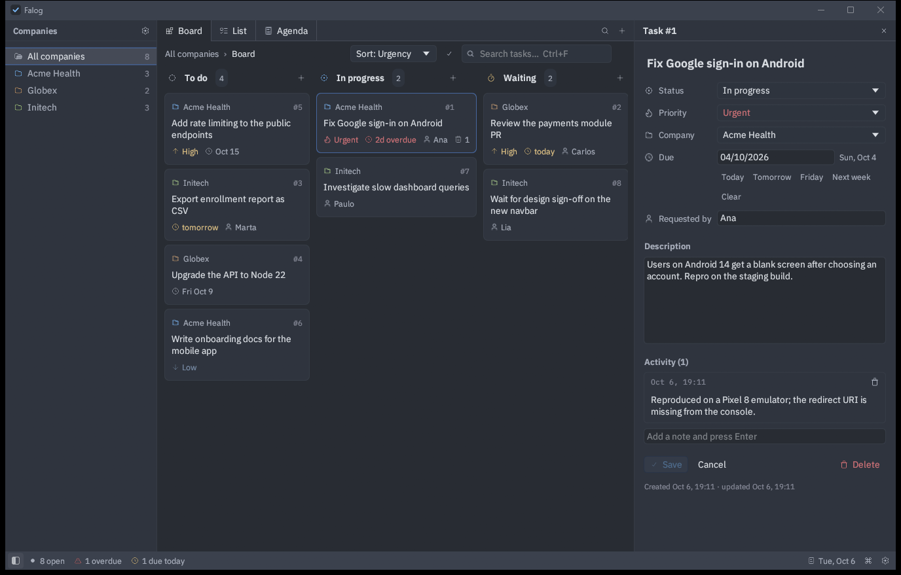
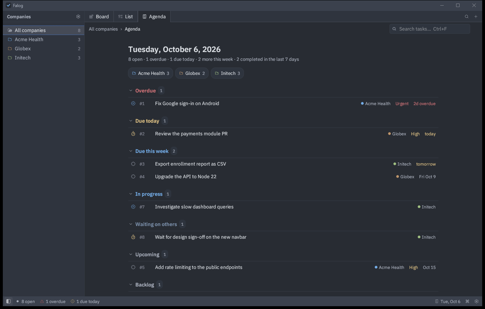
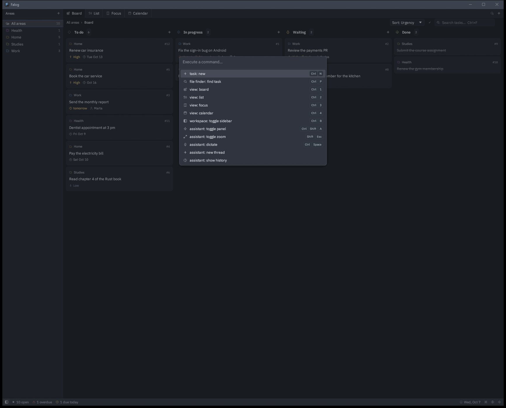
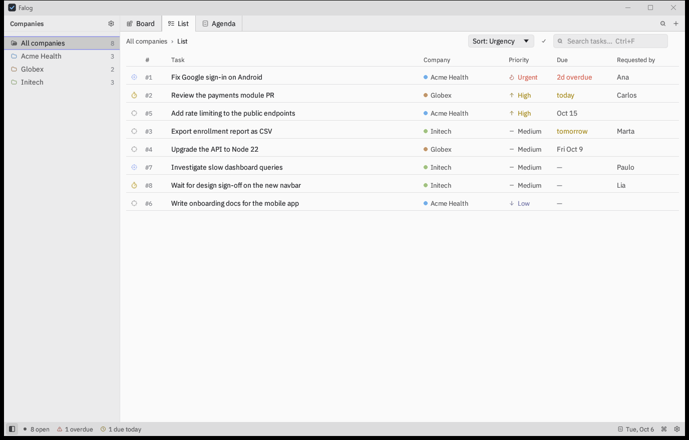
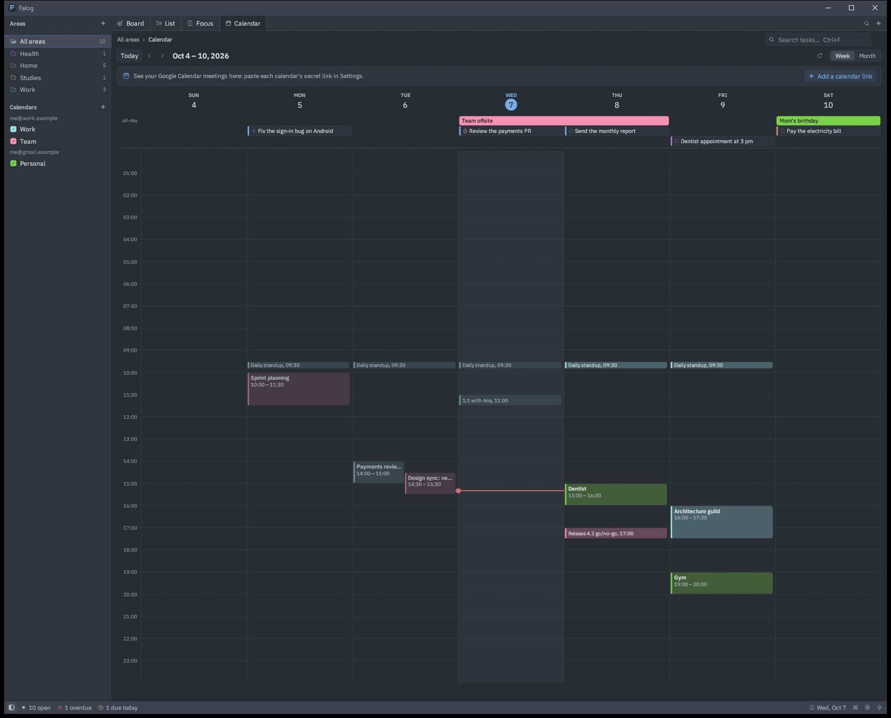

# Falog

**A task board you talk to.** Falog is a local-first desktop app for developers who juggle work for
several companies at once and still have a life to run. You tell your AI assistant about a request or
an appointment, by voice or text, and it files the task for you; Falog shows everything on a Zed-inspired board, list, focus view and calendar.



## Why

Requests arrive everywhere: a call, a chat message, a hallway comment. Writing each one down breaks your
flow, so many never get written down, and Monday morning starts with an hour of "what was I supposed to
do?". Falog removes the friction: say *"Ana from Acme asked me to fix the Google sign-in on Android,
it's urgent, needs to ship Friday"* and the task exists, with area, requester, due date and priority.

## Features

- **Board, List and Focus views.** Drag cards between *To do*, *In progress*, *Waiting* and *Done*.
  Focus groups open work into *Overdue*, *Due today*, *Due this week*, and so on.
- **Your meetings too.** A Calendar tab shows Google Calendar from as many accounts as you like (work
  and personal), by week or month, next to the tasks due each day. Paste each calendar's private link;
  no sign-in needed.
- **An assistant you talk to, built in.** Open the assistant dock (`Ctrl+Shift+A`), press `Ctrl+Space`
  and say what changed: Claude creates, updates and summarizes tasks while the board updates live.
  Speech is transcribed locally with Whisper, and Claude runs on your own Claude Code login.
- **Works with any MCP client too.** `falog-mcp` exposes your tasks through the
  [Model Context Protocol](https://modelcontextprotocol.io). Due dates like "friday", "next week" or
  "amanhã" are understood.
- **Work and life, one place.** Tasks belong to areas: each employer or client, plus personal ones like
  *Personal* or *Health*. Each area has a color and a sidebar entry to filter by.
- **Zed's look and feel.** Same One Dark / One Light palettes, IBM Plex Sans, Lucide icons, a command
  palette (`Ctrl+Shift+P`) and a task finder (`Ctrl+P`).
- **Local and private.** A single SQLite file on your machine. No account, no server.
- **Always there.** Opens at sign-in and keeps a single window.

| Focus | Command palette | Light theme |
|---|---|---|
|  |  |  |

## How it works

```
 assistant dock ──► Claude Code (headless) ──┐
 (speech: Whisper, on device)                ├──► falog-mcp ──┐
 any MCP client ──► Claude ──────────────────┘                ├──► SQLite (falog.db)
                       falog (desktop app)  ◄─────────────────┘    the app reloads when the file changes
```

The workspace has four crates:

| Crate | What it is |
|---|---|
| `falog-core` | Domain model, natural-language due dates, agenda rules and the SQLite store |
| `falog-mcp` | MCP server over stdio (`falog-mcp`) |
| `falog-calendar` | Read-only Google Calendar: iCal links, OAuth sign-in, calendars, events, local cache |
| `falog-desktop` | The egui desktop app (`falog`) |

Design notes, conventions and the roadmap live in [`.spec/`](.spec/CLAUDE.md).

## Install

Falog runs on Windows, macOS and Linux. Every platform needs [Rust](https://rustup.rs) to build it, and
the assistant dock uses [Claude Code](https://claude.com/claude-code), signed in with `claude` once.
It can also talk to any agent that speaks the [Agent Client Protocol](https://agentclientprotocol.com):
Claude through its ACP adapter (Node.js 22+), [Gemini CLI](https://github.com/google-gemini/gemini-cli)
and Codex are built in, and Settings › Assistant adds your own (name, command, environment). Each one runs
on your own login or subscription.
Voice input compiles whisper.cpp, which needs CMake and libclang at build time; when they are missing
the installers build Falog without voice.

The installers build in release mode, install for the current user, enable launch at sign-in, register
the MCP server with Claude Code (`claude mcp add --scope user falog`), copy the assistant workspace to
`~/falog-assistant` and start Falog. The uninstallers revert it and keep your tasks unless you ask.
Your tasks live in one SQLite file, `falog.db`, in `~\.falog` on Windows,
`~/Library/Application Support/Falog` on macOS and `~/.local/share/Falog` on Linux (`FALOG_DB`
points both binaries at another file). On Windows it is not in AppData because packaged apps such as
Claude desktop give the processes they start a private copy of AppData, so tasks filed from there would
not show up in Falog. Older versions kept it in `%APPDATA%\Falog`; Falog moves it on first start.

### Windows

Requires the MSVC build tools (with CMake). For voice, [LLVM](https://llvm.org)
(`winget install LLVM.LLVM`); for speech recognition on the GPU, the
[Vulkan SDK](https://vulkan.lunarg.com).

```powershell
powershell -ExecutionPolicy Bypass -File .\scripts\install.ps1
```

Installs to `%LOCALAPPDATA%\Falog` with a Start menu shortcut. `scripts\uninstall.ps1 [-RemoveData]`
reverts it. Keep the checkout path short (like `C:\Projects\falog`) when building with the GPU: the
Vulkan shader build fails past Windows' 260-character path limit.

### macOS

Requires the Xcode command line tools (`xcode-select --install`) and, for voice, CMake
(`brew install cmake`). Speech recognition runs on the GPU through Metal.

```sh
./scripts/install.sh
```

Installs `~/Applications/Falog.app` (in Launchpad, Spotlight and the Dock) with `falog-mcp` inside it,
and a LaunchAgent for launch at sign-in. macOS asks for the microphone the first time you dictate; the
app is signed ad hoc on your Mac, so it asks again after a reinstall. `scripts/uninstall.sh
[--remove-data]` reverts it.

### Linux

Requires a C toolchain, `pkg-config` and the ALSA headers; for voice, CMake and libclang. On Debian and
Ubuntu:

```sh
sudo apt install build-essential pkg-config libasound2-dev cmake libclang-dev
./scripts/install.sh
```

Installs `falog` and `falog-mcp` to `~/.local/bin`, an app menu entry and icon, and an XDG autostart
entry. Speech recognition runs on the GPU through Vulkan when the Vulkan headers and `glslc` are
present at build time (`sudo apt install libvulkan-dev glslc`); pass `--no-gpu` to skip it.
`scripts/uninstall.sh [--remove-data]` reverts it. Falog runs on X11 and Wayland; on Wayland a second
launch may not be able to bring the existing window to the front.

## Talking to your tasks

**In Falog:** open the assistant dock with the ✦ button in the status bar or `Ctrl+Shift+A`. Type, or
press `Ctrl+Space` (or the mic button), speak, and press it again: your words are transcribed on this
computer and sent. The first time, Falog downloads the Whisper model (~574 MB). Pick your voice
language and whether dictation sends right away in Settings. Like Zed, each conversation is a thread:
`+` starts a new one and the clock button lists past threads, so you can keep one per area and pick up
any of them later, even after a restart. The composer footer picks the model (Opus, Sonnet, Haiku...),
effort and permission mode of the thread, toggles fast mode, and shows how full the context is;
typing `/` lists the agent's commands (`/compact`, `/context`...). `Shift+Esc` zooms the assistant
to fill the window.

**From Claude Code or another MCP client:** open a session in `~/falog-assistant` (its `CLAUDE.md`
teaches Claude how to file tasks) or mention tasks in any session, since the server is registered for
your user.

- *"Got two things from Globex: review Carlos's payments PR today, and upgrade the API to Node 22 by Friday."*
- *"I'm blocked on the navbar until Lia signs off on the design."*
- *"Dentist on Thursday at 3, put it in Personal."*
- *"Book a call with Ana tomorrow at 3 on Acme, with a Meet link."*
- *"What meetings do I have today?"*
- *"Good morning, what's on my plate this week?"*

Any MCP client works; point it at `falog-mcp`.

## Google Calendar



Falog shows your meetings (read-only) next to your tasks. The simplest way is each calendar's **secret
address in iCal format**, a private link Google gives you; no sign-in and nothing to set up:

1. Open [Google Calendar settings](https://calendar.google.com/calendar/r/settings) (the gear, then
   *Settings*).
2. On the left, under *Settings for my calendars*, click the calendar.
3. In *Integrate calendar*, copy the **Secret address in iCal format**.
4. In Falog, open Settings (`Ctrl+,`) → *Calendar*, paste it, and click **Add**. Repeat for each
   calendar and account (work, personal...).

The address works like a password: anyone who has it can read that calendar. Falog keeps it in
`calendar/google.json` next to the database and never shows it whole; if it leaks, *Reset* it in the same
Google page and add the new one. Falog reads the links every five minutes while the Calendar tab is open
(and on *Refresh*); Google may take a little while to publish a change in the feed. Feeds carry no color,
so Falog picks one; change it in Settings.

### Sign in with Google instead (advanced)

Some work accounts hide the secret address (their admin turned it off). For those, Falog can sign in with
Google, which also shows new events right away, but it needs **your own** Google OAuth client, because
Google does not let an open source app ship a shared one. Set it up once, in about five minutes:

1. In the [Google Cloud console](https://console.cloud.google.com), create a project and enable the
   [Google Calendar API](https://console.cloud.google.com/apis/library/calendar-json.googleapis.com).
2. Open the [OAuth consent screen](https://console.cloud.google.com/auth/overview): pick *External*,
   fill in the app name and your email, and **publish** the app. While it is in *Testing*, Google
   signs you out every 7 days. Google shows an "unverified app" warning when you sign in; choose
   *Advanced → Go to …* (it is your own client).
3. In [Credentials](https://console.cloud.google.com/apis/credentials), create an *OAuth client ID*
   of type **Desktop app**.
4. In Falog, open Settings (`Ctrl+,`) → *Calendar* → *Sign in with Google instead*, paste the client ID
   and secret, save, and click **Connect Google account**. Repeat for each account.

Work accounts whose admins block third-party apps cannot connect this way either. While the app is in
*Testing*, add each email you connect under *Audience › Test users*, or Google answers "Access blocked".

Signed-in accounts also let the assistant **book meetings**: "call with Ana tomorrow at 3 on Acme"
creates the event in that area's account, with a Meet link for calls. Accounts connected before this
existed show *read only* in Settings until you click *Reconnect*. Calendar links stay read-only.

### Areas

Each email (account or calendar link) belongs to one area, and an area can have several emails: pick it
in Settings › Calendar › *Area of each account*. Filtering by an area in the sidebar then shows only its
meetings, and the assistant books an area's meetings in its account.

The sidebar of the Calendar tab lists every calendar, by link and by account, to show or hide. Tokens,
links and the event cache live in `calendar/` next to the database; removing an account in Settings
revokes its token.

## Keyboard shortcuts

On macOS, `Cmd` takes the place of `Ctrl`.

| Keys | Action |
|---|---|
| `Ctrl+Shift+P` | Command palette |
| `Ctrl+P` | Find a task |
| `Ctrl+N` | New task |
| `Ctrl+1` … `Ctrl+4` | Board / List / Focus / Calendar |
| `T` / `J` / `K` / `W` / `M` | Calendar: today / next / previous / week / month |
| `Ctrl+F` | Search |
| `Ctrl+B` | Toggle sidebar |
| `Ctrl+Shift+A` | Toggle the assistant |
| `Shift+Esc` | Zoom the assistant to fill the window, and back |
| `Ctrl+Space` | Start / finish dictating to the assistant |
| `Ctrl+S` | Save the task being edited |
| `Ctrl+,` | Settings |
| `Esc` | Close the task panel or a dialog |

## Development

```powershell
cargo test --workspace                 # unit tests for every crate
cargo run -p falog-desktop             # the app, on your real database
.\scripts\seed-demo.ps1                # sample data in target\demo.db
$env:FALOG_DB = "$PWD\target\demo.db"; cargo run -p falog-desktop
```

On macOS and Linux:

```sh
./scripts/seed-demo.sh                 # sample data in target/demo.db
FALOG_DB="$PWD/target/demo.db" cargo run -p falog-desktop
```

`FALOG_DB` points both binaries at another database file. `cargo build --no-default-features` skips
voice input (no CMake or libclang needed); `--features falog-desktop/gpu` runs it on the GPU (Metal on
macOS, Vulkan elsewhere).

Building on Linux also needs `pkg-config` and the ALSA headers (`libasound2-dev`); CI installs the
packages it uses in [`.github/workflows/ci.yml`](.github/workflows/ci.yml).

## Credits

Falog's visual design follows [Zed](https://zed.dev). It bundles the One Dark and One Light color values
(MIT), IBM Plex Sans and Lilex (SIL Open Font License) and Lucide icons (ISC) as shipped in the Zed
repository; their licenses are next to the assets in `crates/falog-desktop/assets`. The app icon is
original artwork under the project's MIT license; its SVG sources are in
`crates/falog-desktop/assets/icon` and `tools/icon` regenerates the PNG, ICO and ICNS files.

## License

[MIT](LICENSE)
